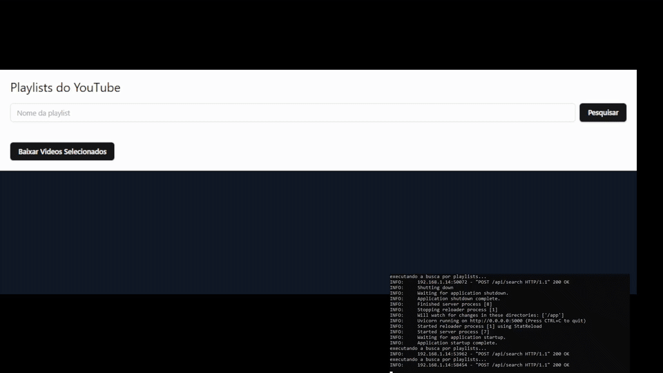

# Aplicação para baixar vídeos e áudios do Youtube e salvar localmente

## Resumo
O código desse repositório tem por objetivo salvar arquivos de vídeo ou áudio do YouTube, salvando localmente, permitindo a sua reprodução sem acessar a plataforma.  
Os arquivos são salvos em um dispositivo local, que é usado para armazenar a biblioteca do Jellyfin (gerenciador de arquivos de mídia), que automaticamente reconhece os novos arquivos e adiciona à playlist, podendo ser acessada por qualquer dispositivo da rede local.  

## Ferramentas utilizadas
O backend da aplicação foi feita em python, com funções para procurar o termo desejado em playlists existentes no YouTube, e depois fazer o download dos vídeos selecionados.  
A bilbioteca principal utilizada foi a yt_dlp. O código foi encapsulado em um container Docker, para facilitar a execução.  
O frontend foi feito com o framework Remix, podendo ser acessada por qualquer dispositivo na mesma rede local.  

## Execução
O termo digitado é pesquisado somente em playlists, e retorna as 5 primeiras listas.  
O usuário pode selecionar todos os arquivos de uma ou mais playlists, ou arquivos separados de listas diferentes.  
Os arquivos selecionados são baixados em uma pasta no raspberry pi configurada como biblioteca para o Jellyfin, que reconhece o novo arquivo e adiciona à playlist.

## Nota  
Existem diversas bibliotecas para consumir dados do YouTube, que podem ficar defasadas à medida que essa plataforma cria novas formas de impedir o download de certos conteúdos.

## Exemplo
O vídeo abaixo mostra o funcionamento da aplicação, com o frontend e as respostas do backend.  

